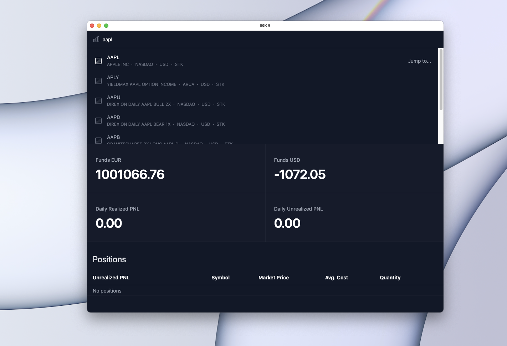
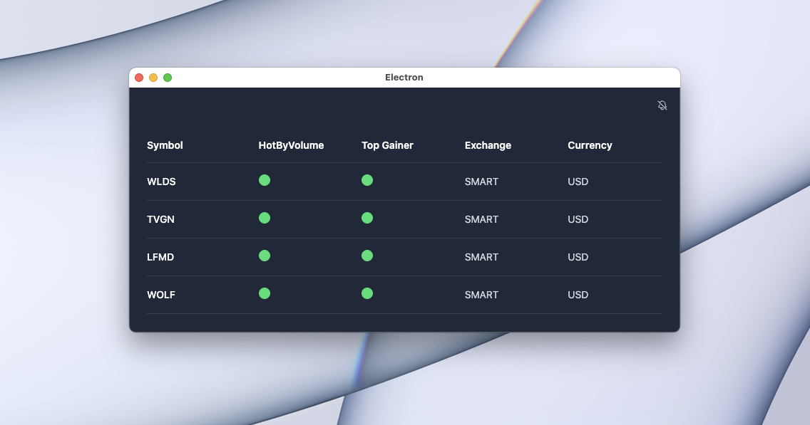
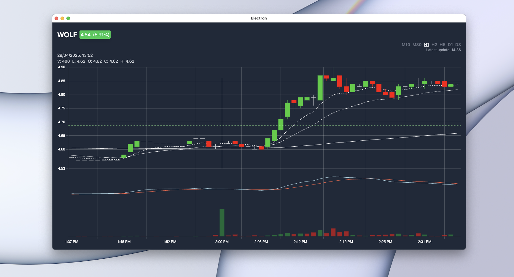
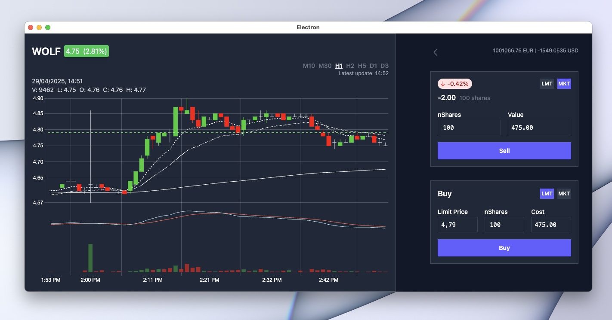

# daytrader

[](https://creativecommons.org/licenses/by-nc/4.0/)


Custom Trading Interface for Interactive Brokers

A personal trading interface (web or desktop via Electron) built for Interactive Brokers (IBKR). It offers a modern, minimal alternative to TWS, focused on the core features needed for day trading.

> ⚠️ Use this software at your own risk. It's intended for personal use only.

## Features

### 🔍 Simple Stock Search

- Search stocks quickly using just your keyboard
- View daily P&L at a glance
- Jump to your current positions



---

### 📈 Market Scanner

- Real-time scanner for top gainers and high-volume stocks
- Sound alerts for updates



---

### 📊 Chart Interface

- Clean, responsive chart with standard timeframes
- Includes VWAP, EMA, MACD, and volume bars
- Real-time updates



---

### 🛒 Intuitive Order Flow

- Click the chart to place a limit buy or sell
- Easily switch to market orders
- Visual feedback for open orders

- simply set your limit price buy clicking inside the chart and the buy interface will open.
- set your limit the same way to place your sell order
- or switch to market price



## Tech Stack

- **Frontend**: Svelte, TailwindCSS, Chart.js, Electron
- **Backend**: Node.js, Express, WebSocket, IB Gateway
- **Interactive Brokers TypeScript API**: [@stoqey/ib](https://github.com/stoqey/ib)

---

## Getting Started

### Prerequisites

- Interactive Brokers account with API access
- IB Gateway running and logged in (paper or live)

### Run

Start the application as a desktop (Electron) app:

```bash
npm run desktop
```

## Disclaimer

This project is for personal use only. It is not affiliated with or endorsed by Interactive Brokers. Use it at your own risk.

## License

daytrader © 2025 by Erik Nogueira Kückelheim is licensed under Creative Commons Attribution-NonCommercial 4.0 International
